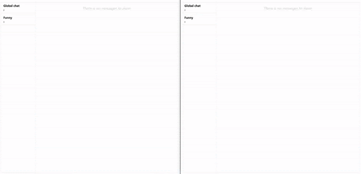

## Tech Stack

 
         

 
 ### Frontend

- ReactJs
- Redux

### Backend

- Node JS
- Express JS
- Socket.IO

### Database

- MongoDB
- MySQL

### Deployment

- AWS EC2

## Screenshots of the App

